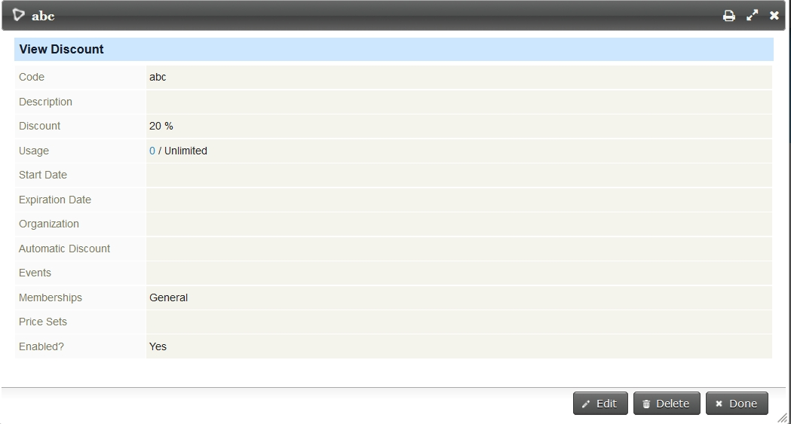
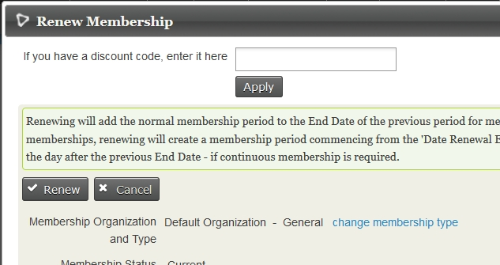
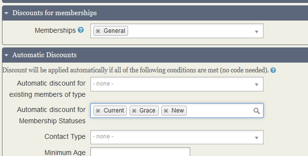

# Testing

This file outlines what should be witnessed in manual testing (WIP)

## Membership discounts - no auto-discount

### Back office forms

- When renewing a discount box is visible if the renewal type is eligible for a discount.
- The discount box is visible for all new membership backoffice forms.

- Provided the code is entered and apply clicked before selecting a membership type the discount is applied
- Clicking 'Save' creates a membership with a suitably discounted contribution.
- there is only one financial trxn row.

### With price set

- The applies and alters the price as long as it is applied AFTER the price set is selected. Before has no effect
- Clicking 'Save' creates a membership with a suitably discounted contribution.
- there is only one financial trxn row.

### Front end forms

- the discount code box is offered when the discount is available - both when configured via price set and when not
(visibly) configured by price set.
- on continuing the confirm page shows the discounted amount
- the contribution is for the discounted amount
- one financial trxn row.

@todo the way 'apply' interacts backoffice (described above) is pretty wierd.
@todo currently auto-discounts are only applied back end for price sets. Changing the type in the renewal does not
change visibility or otherwise of the discount box.
@todo single financial trxn row is possibly incorrect - a JIRA exists on this.

## Membership discounts - auto-discount

Much the same tests as above - discounting did not appear to work on back office renewals (before or after changes) but was otherwise successful
